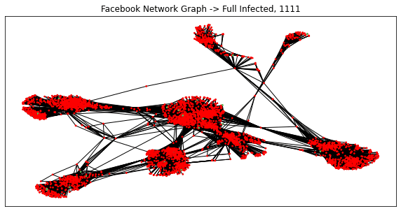

# APM541-Project

---

This is the code and additional results for my APM541 final project on "Particle System Dynamics for Compromised Social Networks".  

Here is a stochastic process run on an incredibly infectious virus and a weak alert.

I programmed the process in Python to create the gif above and other visuals. I programmed the process again in C++ in order to run many more simulations to observe the quasi-stationary distributions. 

Here is a stochastic process starting entirely with infected, showing that entirely infected is not an absorbing state. 
